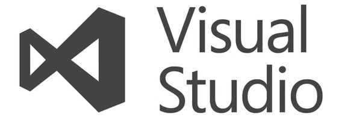

# Visual Studio FAQ

20 February 2024

## Visual Studio 2022

The most comprehensive IDE for .NET and C++ developers on Windows. Fully packed with an array of tools and features to elevate and enhance every stage of software development.

[https://visualstudio.microsoft.com/vs/](https://visualstudio.microsoft.com/vs/)

## Visual Studio Code

A standalone source code editor that runs on Windows, macOS, and Linux. The top pick for JavaScript and web developers, with extensions to support just about any programming language.

[https://code.visualstudio.com/](https://code.visualstudio.com/)